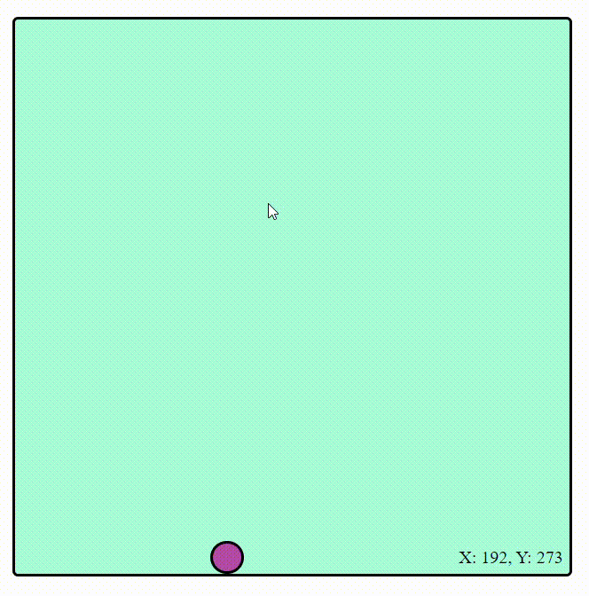

# dropTheBall

Description:

- Click inside the green box to drop a ball. Watch it drop. That's it.
  
- 
You can try for yourself <a href="https://jlobbes.github.io/dropTheBall/">here</a>.

    
    
- This was a small project from when I first started coding. I had been learning for about 12 months by then.

Started: 

- 2021Dec28

Goal: 

- Display use of JS interacting with CSS & HTML.
